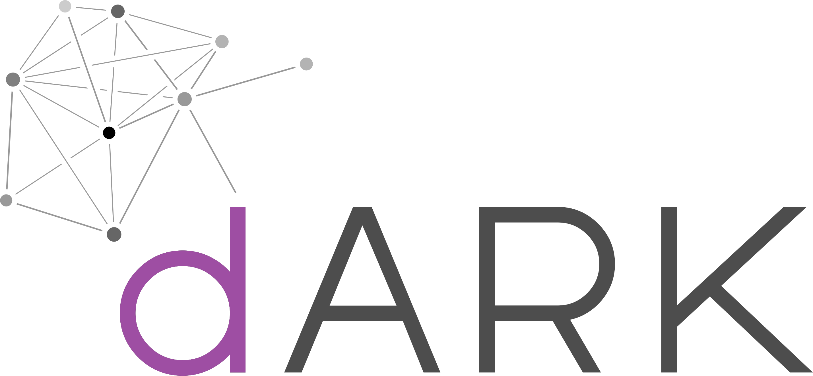

# dARK Resolver

The dARK Resolver is a streamlined version of the ARK resolver, specifically designed to manage Persistent Identifiers (PIDs). PIDs are unique identifiers for digital objects, enabling consistent access regardless of changes in their location or metadata.

The dARK Resolver utilizes the decentralized nature of dARK Core to translate ARK identifiers into the locations of the identified resources or their related metadata. In essence, the dARK Resolver employs blockchain technology for secure and efficient retrieval of PID data. Here's a breakdown of its operation:

- **Querying a dARK PID**: When a user queries a dARK PID, the resolver checks if the PID is linked to the dARK protocol. If so, it retrieves the relevant URL directly from the blockchain.
- **Blockchain Query**: The resolver queries the blockchain network using the PID as a reference to fetch the URL. This process guarantees data integrity and authenticity through the tamper-proof records of the blockchain.
- **Resolving the URL**: After the URL is retrieved, the resolver redirects the user to it, allowing seamless access to the digital object.

By harnessing blockchain technology, dARK ensures that the PID resolution process remains secure, transparent, and resistant to tampering. For detailed technical information on blockchain integration, please refer to our [dARK Technical Documentation](https://github.com/dark-pid/dARK).

> **Table of Contents**:
> 1. [dARK Resolver Goals](#goals)
> 2. [dARK Resolver Functionalities](#functionality)
> 3. [How to Run dARK Resolver](#get-started)


## Goals

The primary objectives of the dARK Resolver project include:

1. **Simplified PID Resolution**: Provide an efficient and user-friendly method for resolving PIDs to their corresponding URLs.

2. **PID Metadata Retrieval from dARK**: The core function of the dARK Resolver is to retrieve PID metadata from the dARK network using the PID as a search key. By leveraging blockchain technology, dARK ensures data integrity and security throughout this process. Any PID registered in the dARK network can be resolved efficiently by querying its metadata with the PID itself as the identifier.

3. **Cross-PID System Resolution**: Develop a resolver that supports multiple PID systems such as DOI, ARK, CCN, and more. While the initial implementation focuses on DOI and ARK, the design allows for future expansion to additional protocols.

## Functionality

The dARK Resolver can retrieve PID metadata using identifiers from various systems, including ARK and DOI. For example, it can perform queries based on ARK or DOI identifiers. If the PID is stored in the dARK network, it will successfully resolve the query regardless of the PID system. If the PID is not available in the dARK network, the resolver will forward the request to the appropriate resolver for an accurate response. The figure below illustrates the resolution process.


Regardless of the PID system (e.g., ARK or DOI), the dARK Resolver adheres to a consistent resolution process:

1. Check if the PID is associated with the dARK protocol.
2. If yes, retrieve the URL from the PID metadata using blockchain technology.
3. If no, create a query to the corresponding protocol's global resolver and obtain the URL.
4. Redirect the user to the resolved URL.

Additionally, when querying using ARK, we verify if the Name Authority Metadata (NAM) of the PID is managed by the responsible PID organization. If the PID falls under the resolver’s purview but is not found, the user will receive a message indicating that the PID was not located.

## Get Started

To start using the dARK Resolver, follow the steps outlined in our [Installation Guide](#how-to-run-the-dark-resolver). This guide will walk you through setting up the resolver, querying PIDs, and leveraging its capabilities.

### How to run the dARK resolver

Follow steps aboves

> **1. Install Libraries**
> 
> 
> ```
> pip install -r requirements.txt
> 
>```
>
>  **2. set system variables**
> 
>> Windows
>> ```ps1
>> $env:MANAGED_NAM_DICT='{"8033":true}'
>> ```
>> 
>> Linux
>> ```sh
>> export env.resolver
>> ```
>
> **3. Start the service**
>
>```sh
>    cd resolver
>    python server.py
>```

It is important to mention that the steps 2 and 3 are required to be executed on every executation (e.g., resolver startup)

start with gunicorn

```sh
    cd resolver
    gunicorn -w 4 -b 0.0.0.0:8000 server:app --daemon
```

### Configuration

For further detail of the resolver parameter see our [Technical Documentation](docs/README.md)

## Contribution

We welcome contributions from the community to enhance the functionality, add support for new protocols, improve blockchain integration, and more. Feel free to fork this repository, make your changes, and submit pull requests. Together, we can make PID resolution more efficient and versatile.

For more details, refer to our [Contribution Guidelines](https://github.com/dark-pid/dARK/blob/docs/contribution_guide.md).

---

[1] In this version we only suport doi and ark. In future release we intended to add more PID system to our resolver.