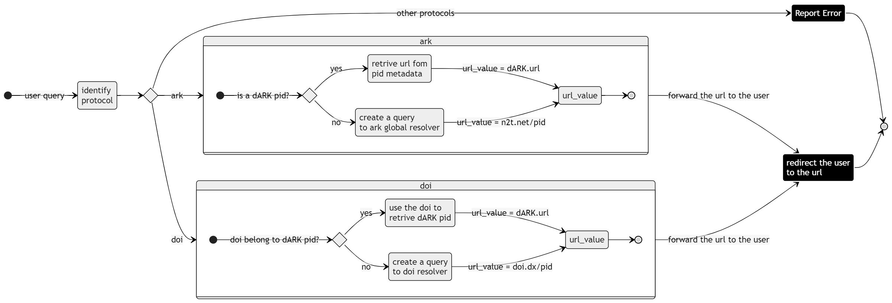

# dARK Resolver

> Table of content :
> 1. [dARK Resolver Goals](#goals)
> 1. [dARK Resolver Functionalities](#functionality)
> 1. [How to run dARK Resolver ](#get-started)

The dARK Resolver is a simplified version of the ARK resolver designed to handle Persistent Identifiers (PIDs). PIDs are used to uniquely identify digital objects and provide a consistent way to access them regardless of changes in location or metadata.


The dARK Resolver leverages dARK pid system. dARK is decentralized PID system. In other words, dARK use blockchain technology to store and retrieve PID data securely and efficiently. Here's a breakdown of how dARK works:

> 1. **PID Registration on Blockchain**: When a new PID is registered within the dARK system, the corresponding metadata, including the URL of the digital object, is stored on the blockchain.
> 2. **Querying a dARK PID**: When a user queries a dARK PID, the resolver checks if the PID is associated with the dARK protocol. If so, it proceeds to retrieve the URL directly from the blockchain.
> 3. **Blockchain Query**: To retrieve the URL from the blockchain, the resolver queries the blockchain network using the PID as a reference. This query ensures data integrity and authenticity, as the information is fetched directly from the blockchain's tamper-proof records.
> 4. **Resolving the URL**: Once the URL is retrieved from the blockchain, the resolver redirects the user to the resolved URL, allowing seamless access to the digital object.

By utilizing blockchain technology, dARK ensures that the PID resolution process is secure, transparent, and resistant to tampering.

For technical details on how the blockchain integration is implemented, please refer to our [Technical Documentation](link-to-technical-dARK-docs).


## Goals

The primary goals of the dARK Resolver project are:

1. **Simplified PID Resolution**: Provide a straightforward method to resolve PIDs to their corresponding URLs, focusing on efficiency and ease of use.

2. **PID Metadata Retrieval from dARK**: 
The core function of the dARK Resolver is to retrieve PID metadata from the dARK network  using the PID as a search key. The dARK employs blockchain technology to ensure data integrity and security during this process. This means that any PID registered in the dARK network can be efficiently resolved by querying its metadata using the PID itself as the identifier.

3. **Cross-PID System Resolution**: Develop a resolver that supports various PID systems, such as DOI, ARK, CCN, and more. While initial implementation covers DOI and ARK, the design allows for future expansion to additional protocols.

## Functionality

The dARK Resolver currently is able to retrieve the PID metadata from dARK using the PID as search key. Moreover, the dARK resolver is able to retrive the medata using any pid as search key. For example, we can perform queries using ARK or DOI identifiers. If the PID is stored in the dARK network we will perform queries regardles the pid system. Furthermore, if the PID is not stored in the dARK network we will forward the request to the proper resolver to provide an adequeted anserw to the user. Thi figure bellow ilustres the resolution processo.



Regardless of the pid system (e.g., ark or doi)[:^1], the dARK Resolver follows a similar resolution process:

1. Check if the PID belongs to the dARK protocol.
2. If yes, retrieve the URL from the PID metadata using blockchain technology.
3. If not, create a query to the corresponding protocol's global resolver and obtain the URL.
4. Redirect the user to the resolved URL.

Notice that if the query is performed considering the ark, we also check if the NAM of the PID is managed (if PID organization is responsible for the resolver). If the PID is the responsibility of the resolver, the user will receive a message informing that PID is not found.


## Get Started

To start using the dARK Resolver, follow the steps outlined in our [Installation Guide](#how-to-run-the-dark-resolver). This guide will walk you through setting up the resolver, querying PIDs, and leveraging its capabilities.

### How to run the dARK resolver

Follow steps aboves

> **1. Install Libraries**
> 
> 
> ```
> pip install -r requirements.txt
> 
>```
>
>  **2. set system variables**
> 
>> Windows
>> ```ps1
>> $env:MANAGED_NAM_DICT='{"8033":true}'
>> ```
>> 
>> Linux
>> ```sh
>> export env.resolver
>> ```
>
> **3. Start the service**
>
>```sh
>    cd resolver
>    python server.py
>```

It is important to mention that the steps 2 and 3 are required to be executed on every executation (e.g., resolver startup)

start with gunicorn

```sh
    cd resolver
    gunicorn -w 4 -b 0.0.0.0:8000 server:app --daemon
```


## Contribution

We welcome contributions from the community to enhance the functionality, add support for new protocols, improve blockchain integration, and more. Feel free to fork this repository, make your changes, and submit pull requests. Together, we can make PID resolution more efficient and versatile.

For more details, refer to our [Contribution Guidelines](link-to-contribution-guidelines).

---

[:^1] In the actual vesion we only suport doi and ark. In future release we intended to add more PID system to our resolver.
