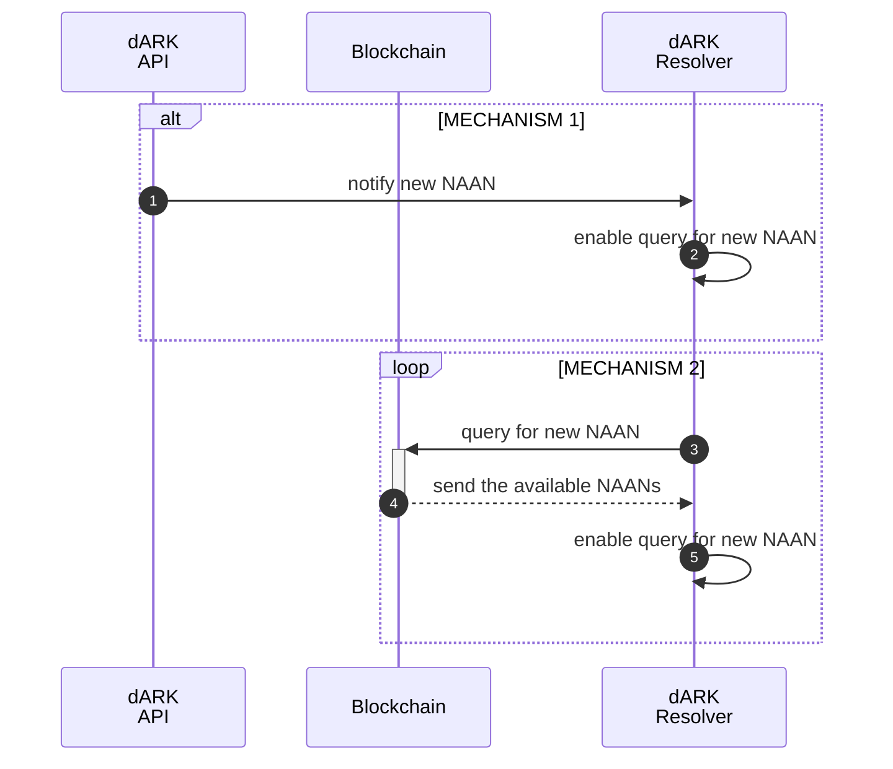

## Update Mechanism

When a new institution is added to the system, the dARK API immediately sends a notification to the Resolver. Upon receiving the notification, the Resolver updates its configuration to allow queries involving the new NAAN (Name Assigning Authority Number). Once the NAAN is added to the dARK Resolver, all registered PIDs (persistent identifiers) associated with that NAAN become available for real-time query.

The diagram outlines the update mechanism within a system designed to maintain current information about institutions, represented by unique identifiers known as NAANs (Name Assigning Authority).

> **Mechanism 1:** When a new institution is added to the system, the [dARK API](./05_dark_api.md) notifies the `Resolver`. Upon receiving this notification, the Resolver adjusts its settings to allow queries regarding the newly added NAAN.
>
> **Mechanism 2:** This mechanism illustrates a continuous update loop. The Resolver periodically queries the `Blockchain` for any updates regarding NAANs. Upon receiving a response from the `Blockchain`, which contains information about available NAANs, the Resolver updates its query capabilities to include these new entries.
> 

In essence, these mechanisms ensure that the Resolver component of the system remains updated with the latest information about institutions, facilitating efficient resolution of persistent identifiers associated with these entities

It is important to mention that once that the NAAN is added to the `dARK Reslover` the PID created are available to queried by the resolver. In other words, the update mechanism is only to add new NAAN to the resolver the PID are available in realtime.
